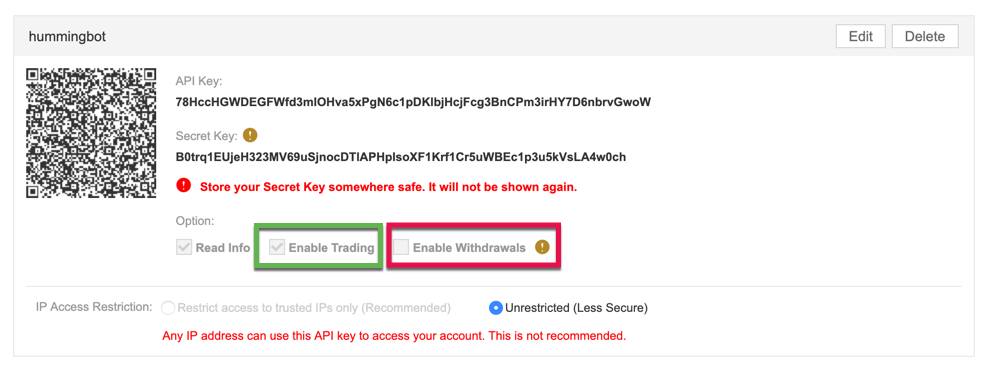

# Binance

## API keys

- Create or log into your [Binance](https://binance.com) account 

- Find 'API' and click enable

- Add a label (maybe 'hummingbot')

- If you have 2FA turned on enter an authorization code If you don't have 2FA turned on you are doing it wrong

- Binance will send you a confirmation email.

- Find the email and click on 'Confirm Create'.

- You'll be taken to the Binance API page an notified the API was created

- Verify that 'Enable Trading' **IS** checked so hummingbot can trade for you. Also verify 'Enable Withdrawls' is **NOT** checked. Currently hummingbot does not support automatic rebalancing, so there is no reason to have this enabled. Additionaly if your API key is comprimised this will allow an attacker to drain your account (especially if 2FA is not enabled).

- Copy your **Secret Key** and **API KEY** into your global configuration file: `conf_global.yml`

- Note you will not be shown the Secret Key again once you leave the Binance API screen. If you lose it you'll need to delete this API key on Binance and create new one. (You should also delete and recreate keys if you suspect your keys have been comprimised or made public in any way)

- **Remember:** Do not push conf_global.yml to a github repo unless you are hiding the API keys in some way (like using environment variables).

- **Recommended:** Restrict access to trusted IP addresses. This may or may not work for you. If you run hummingbot from a location where the IP address changes you'll need to update this field. Residential internet providers may assign you a new **Public** IP address if you power cycle your modem. You can use [This IP Address Finder website](https://www.whatismyip.com/) to check your current IP address. (To restrict the IP Addess first click on 'Edit', then 'Save' when you are done.)

- [Official Binance API Documentation](https://support.binance.com/hc/en-us/articles/360002502072-How-to-create-API)

---

Help our community add documentaion for more exchanges are enabled in hummingbot.

Please use the [Contributor's Guide](https://github.com/coinalpha/hummingbot/blob/master/CONTRIBUTING.md) to ensure your pull request gets accepted.

